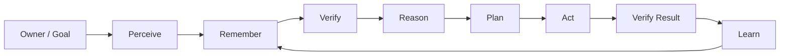
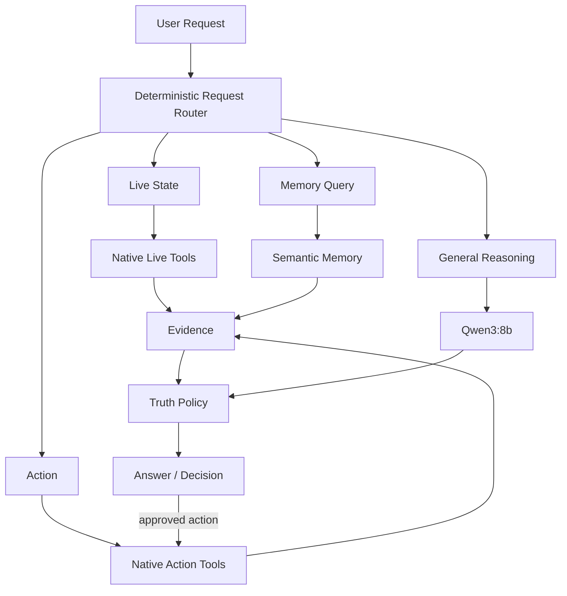
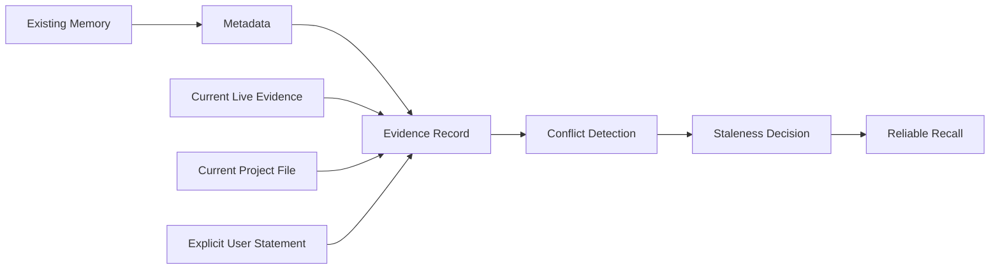
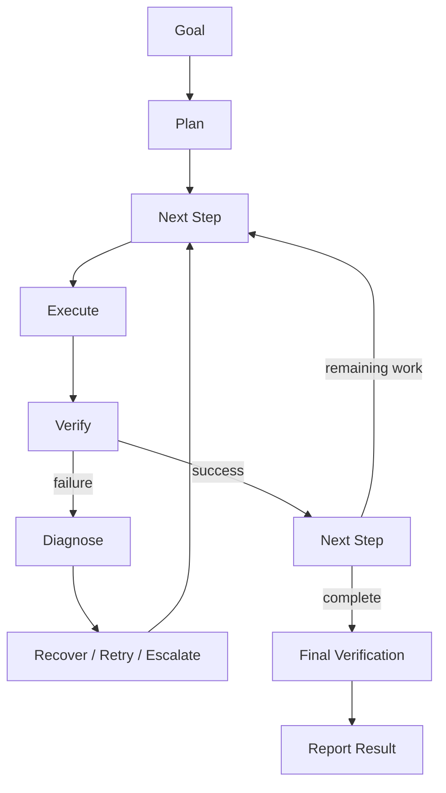

# CYRAX Architecture

CYRAX is designed as a local-first cognitive loop rather than a chatbot wrapper.

## North Star



The loop is intentionally closed: successful execution produces evidence, verification updates knowledge, and future decisions use the improved context.

## Runtime Architecture



## Source Authority

When evidence conflicts, the runtime uses this deterministic order:

```text
live_tool
    > runtime
    > project_file
    > user_statement
    > memory
    > history
    > llm_knowledge
```

The purpose is not to make the model "believe" a hierarchy. The purpose is to make the runtime enforce one.

## Truth-Aware Memory

Phase 2 extends ordinary Markdown memory into evidence-aware memory:



A memory should be able to answer:

- what is the claim?
- where did it come from?
- when was it observed or verified?
- how confident are we?
- is it active, stale, or contradicted?
- what evidence superseded it?

## Execution Loop

Phase 3 will add explicit task state:



## Roadmap

```text
Phase 1  Reliable Agent Core
   │
   ▼
Phase 2  Truth-Aware Second Brain   ← NEXT
   │
   ├── provenance
   ├── timestamps
   ├── confidence
   ├── contradiction detection
   ├── stale-memory handling
   └── evidence-backed recall
   │
   ▼
Phase 3  Planning + Reliable Execution
   │
   ▼
Phase 4  Multimodal + Computer Agency
   │
   ▼
Phase 5  Personal Autonomous Intelligence
```

## Design Rule

A new capability is not considered complete merely because it works once. It must have:

1. a source-of-truth rule,
2. an explicit failure mode,
3. a verification path,
4. observable output, and
5. regression coverage.

That keeps CYRAX moving toward trustworthy autonomy instead of accumulating disconnected features.
